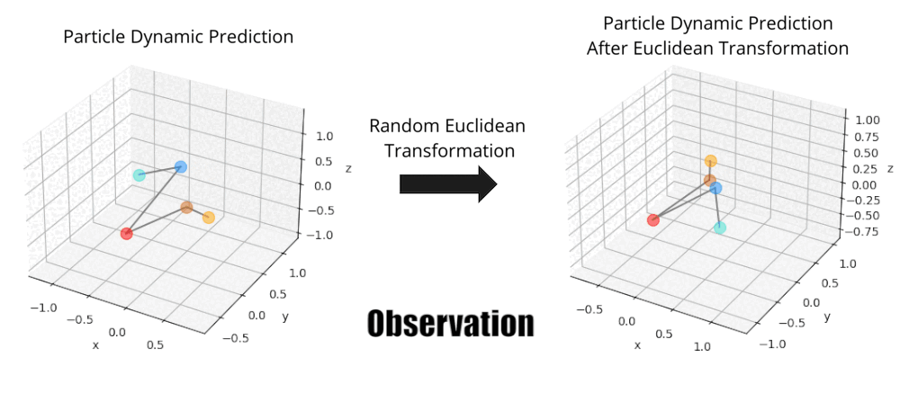
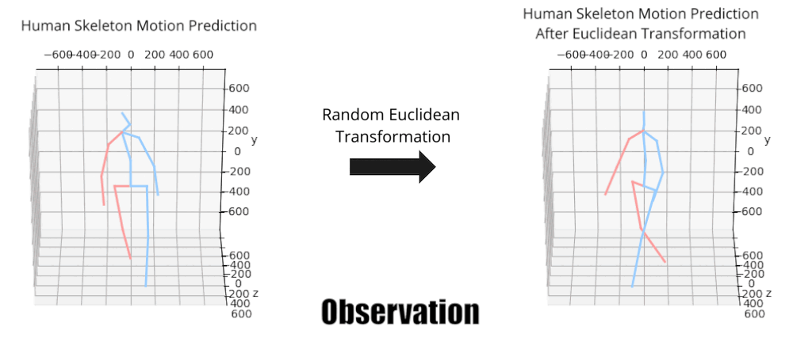
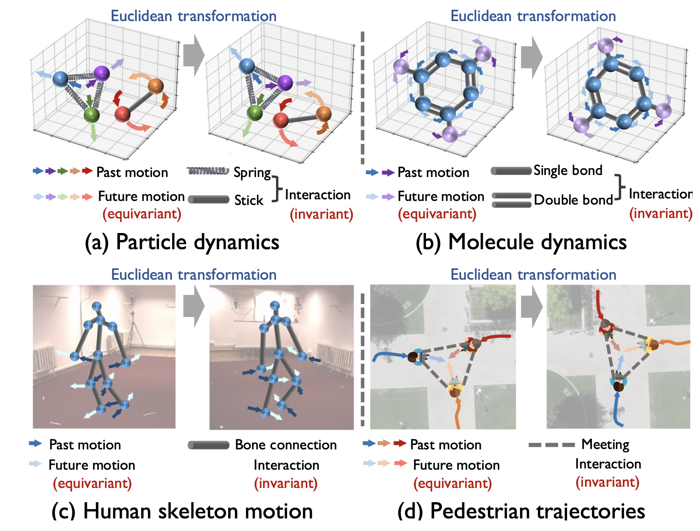

# EqMotion

Official implementation of our paper:  
**EqMotion: Equivariant Multi-agent Motion Prediction with Invariant Interaction Reasoning**  
Chenxin Xu, Robby T. Tan, Yuhong Tan, Siheng Chen, Yuguang Wang, Xinchao Wang, Yanfeng Wang  
**CVPR 2023** [[paper]](https://arxiv.org/abs/2303.10876)



**Abstract**: Learning to predict agent motions with relationship reasoning is important for many applications. In motion prediction tasks, maintaining motion equivariance under Euclidean geometric transformations and invariance of agent interaction is a critical and fundamental principle. However, such equivariance and invariance properties are overlooked by most existing methods.To fill this gap, we propose EqMotion, an efficient equivariant motion prediction model with invariant interaction reasoning. To achieve motion equivariance, we propose an equivariant geometric feature learning module to learn a Euclidean transformable feature through dedicated designs of equivariant operations. To reason agent's interactions, we propose an invariant interaction reasoning module to achieve a more stable interaction modeling. To further promote more comprehensive motion features, we propose an invariant pattern feature learning module to learn an invariant pattern feature, which cooperates with the equivariant geometric feature to enhance network expressiveness. We conduct experiments for the proposed model on four distinct scenarios: particle dynamics, molecule dynamics, human skeleton motion prediction and pedestrian trajectory prediction. Experimental results show that our method is not only generally applicable, but also achieves state-of-the-art prediction performances on all the four tasks, improving by 24.0/30.1/8.6/9.2%. 

<div align="center">
	
</div>

## Recommand Dependencies
* Cuda 11.0
* Python 3.7
* Pytorch 1.8.1

## Particle Dynamic
### Data preparation
We already provide the dataset file in "n_body_system/dataset". If you want to generate data by yourself, for the prediction task please run:
```
cd n_body_system/dataset
python generate_dataset.py --n_balls 5 --simulation charged --num-train 50000
```
For the reasoning task please run:
```
cd n_body_system/dataset
python generate_dataset.py --n_balls 5 --simulation springs --num-train 50000
```
### Run experiments
For the prediction task:
```
CUDA_VISIBLE_DEVICES={GPU_ID} python main_nbody.py 
```

For the reasoning task:
```
CUDA_VISIBLE_DEVICES={GPU_ID} python main_nbody_reasoning.py 
```

## Molecule Dynamic
### Data preparation
The MD17 dataset can be downloaded from [MD17](http://www.sgdml.org/#datasets). Put the downloaded file in "md17/dataset" and run
```
cd md17/
python preprocess.py 
```
### Run experiments
```
CUDA_VISIBLE_DEVICES={GPU_ID} python main_md17.py --mol {molecule_name} 
```

## 3D Human Skeleton Motion
### Data preparation
Download Human3.6M dataset from its [website](http://vision.imar.ro/human3.6m/description.php) and put the files into "h36m/dataset".
### Run experiments
#### Training
To train a model of short-term prediction task, run
```
CUDA_VISIBLE_DEVICES={GPU_ID} python main_h36m.py --past_length 10 --future_length 10 --channel 72  
```
To train a model of long-term prediction task, run
```
CUDA_VISIBLE_DEVICES={GPU_ID} python main_h36m.py --past_length 25 --future_length 25 --channel 96 --apply_decay  
```
#### Evaluation
To evaluate a model of short-term prediction task, run
```
CUDA_VISIBLE_DEVICES={GPU_ID} python main_h36m.py --past_length 10 --future_length 10 --channel 72 --model_name {your_model_name} --test
```
To evaluate a model of long-term prediction task, run
```
CUDA_VISIBLE_DEVICES={GPU_ID} python main_h36m.py --past_length 25 --future_length 25 --channel 96 --model_name {your_model_name} --test
```
#### Results
We provide our trained models in "h36m/saved_models" and the overall average results at different time are reported below.

|                | 80ms   | 160ms  | 320ms  | 400ms  |
|----------------|------|------|------|------|
| EqMotion| 9.1 | 20.1 | 43.7 | 55.0 |

|                | 560ms   | 1000ms  |
|----------------|------|------|
| EqMotion| 73.4 | 106.9 |

## Pedestrian Trajectory
### Data preparation
To preprocess the raw data to .npy file, run

```
cd eth_ucy/
python process_eth_data_diverse.py --subset {subset_name} 
```
### Run experiments
To train, run
```
CUDA_VISIBLE_DEVICES={GPU_ID} python main_eth_diverse.py --subset {subset_name}
```
To evaluate, run
```
CUDA_VISIBLE_DEVICES={GPU_ID} python main_eth_diverse.py --subset {subset_name} --test --model_name {saved_model_name}
```
### Results
We provide our trained models in "eth_ucy/saved_models" and the results (ADE/FDE) of different subsets are reported below.

|               | ETH   | HOTEL  | UNIV  | ZARA1  |ZARA2  |AVG  |
|----------------|------|------|------|------|------|------|
| EqMotion| 0.40/0.61 | 0.12/0.18 |0.23/0.43| 0.18/0.32 |0.13/0.23 |0.21/0.35|


## Acknowledgements
We thank for the part of training code provided by [EGNN](https://github.com/vgsatorras/egnn). We also thank for part of the data preprocessing code provided by [SPGSN](https://github.com/MediaBrain-SJTU/SPGSN) and [AgentFormer](https://github.com/Khrylx/AgentFormer).

## Citation
If you find our work useful in your research, please cite our paper:
```bibtex
@inproceedings{xu2023EqMotion,
    title={EqMotion: Equivariant Multi-agent Motion Prediction with Invariant Interaction Reasoning},
    author={Chenxin Xu, Robby T. Tan, Yuhong Tan, Siheng Chen, Yuguang Wang, Xinchao Wang, Yanfeng Wang},
    booktitle={The IEEE/CVF Conference on Computer Vision and Pattern Recognition (CVPR)},
    year={2023}
}
```


